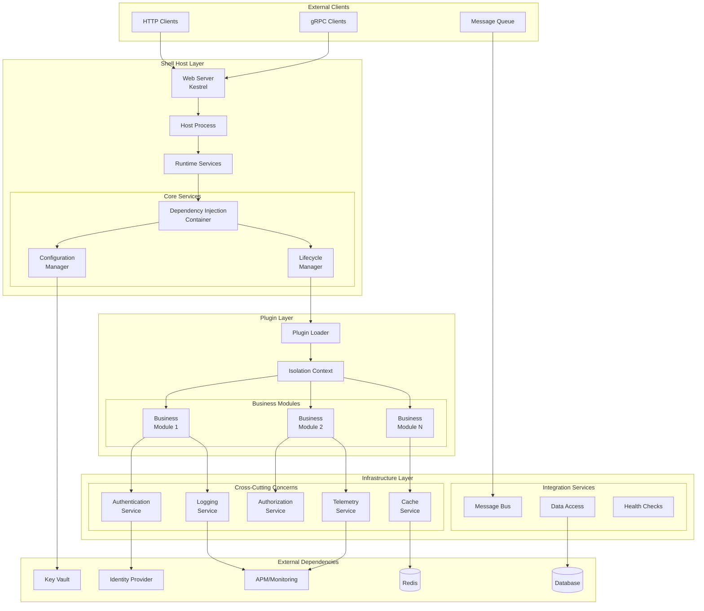
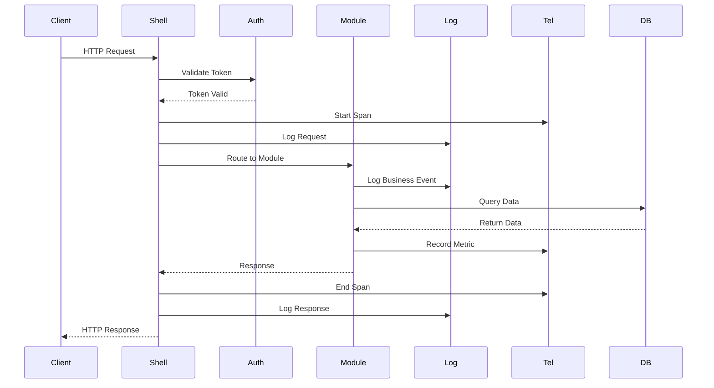
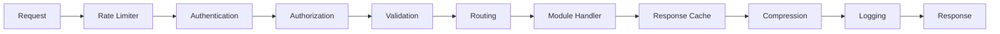

# .NET Core Shell - Technical Architecture

## System Architecture Overview



## Component Architecture

### 1. Host Process Architecture

```csharp
namespace DotNetShell.Host
{
    public class ShellHost
    {
        private readonly IHostBuilder _hostBuilder;
        private readonly IPluginLoader _pluginLoader;
        private readonly IServiceCollection _services;

        public ShellHost()
        {
            _hostBuilder = Host.CreateDefaultBuilder()
                .ConfigureWebHostDefaults(webBuilder =>
                {
                    webBuilder.UseStartup<ShellStartup>();
                    webBuilder.UseKestrel(ConfigureKestrel);
                });
        }

        public async Task RunAsync()
        {
            // Load configuration
            var configuration = LoadConfiguration();

            // Initialize infrastructure services
            InitializeInfrastructure(configuration);

            // Discover and load plugins
            var plugins = await _pluginLoader.DiscoverPluginsAsync();

            // Initialize plugins in isolated contexts
            foreach (var plugin in plugins)
            {
                await LoadPluginAsync(plugin);
            }

            // Start host
            await _hostBuilder.Build().RunAsync();
        }
    }
}
```

### 2. Plugin Isolation Architecture

```csharp
namespace DotNetShell.Core.Plugins
{
    public class PluginLoadContext : AssemblyLoadContext
    {
        private readonly AssemblyDependencyResolver _resolver;
        private readonly string _pluginPath;
        private readonly Dictionary<string, Assembly> _sharedAssemblies;

        public PluginLoadContext(string pluginPath, bool isCollectible = true)
            : base(isCollectible: isCollectible)
        {
            _pluginPath = pluginPath;
            _resolver = new AssemblyDependencyResolver(pluginPath);
            _sharedAssemblies = new Dictionary<string, Assembly>();

            // Register shared assemblies (interfaces)
            RegisterSharedAssembly(typeof(IAuthenticationService).Assembly);
            RegisterSharedAssembly(typeof(ILoggingService).Assembly);
        }

        protected override Assembly Load(AssemblyName assemblyName)
        {
            // Check if it's a shared assembly
            if (_sharedAssemblies.TryGetValue(assemblyName.Name, out var sharedAssembly))
            {
                return sharedAssembly;
            }

            // Try to load from plugin directory
            string assemblyPath = _resolver.ResolveAssemblyToPath(assemblyName);
            if (assemblyPath != null)
            {
                return LoadFromAssemblyPath(assemblyPath);
            }

            return null;
        }

        protected override IntPtr LoadUnmanagedDll(string unmanagedDllName)
        {
            string libraryPath = _resolver.ResolveUnmanagedDllToPath(unmanagedDllName);
            if (libraryPath != null)
            {
                return LoadUnmanagedDllFromPath(libraryPath);
            }

            return IntPtr.Zero;
        }
    }
}
```

### 3. Service Layer Architecture

```csharp
namespace DotNetShell.Abstractions
{
    // Core service interfaces that all plugins can use

    public interface IAuthenticationService
    {
        Task<AuthenticationResult> AuthenticateAsync(string token);
        Task<string> GenerateTokenAsync(ClaimsPrincipal principal);
        Task<bool> ValidateTokenAsync(string token);
        Task RevokeTokenAsync(string token);
    }

    public interface IAuthorizationService
    {
        Task<bool> AuthorizeAsync(ClaimsPrincipal user, string resource, string action);
        Task<bool> HasPermissionAsync(ClaimsPrincipal user, string permission);
        Task<bool> IsInRoleAsync(ClaimsPrincipal user, string role);
        Task<IEnumerable<string>> GetUserPermissionsAsync(ClaimsPrincipal user);
    }

    public interface ILoggingService
    {
        void LogTrace(string message, params object[] args);
        void LogDebug(string message, params object[] args);
        void LogInfo(string message, params object[] args);
        void LogWarning(string message, params object[] args);
        void LogError(Exception ex, string message, params object[] args);
        void LogCritical(Exception ex, string message, params object[] args);
        IDisposable BeginScope<TState>(TState state);
        void LogStructured<T>(LogLevel level, string message, T data);
    }

    public interface ITelemetryService
    {
        ISpan StartSpan(string operationName, SpanKind kind = SpanKind.Internal);
        void RecordMetric(string name, double value, Dictionary<string, string> tags = null);
        void RecordEvent(string name, Dictionary<string, object> properties = null);
        ITimer StartTimer(string name);
        void RecordDuration(string name, TimeSpan duration);
        Activity StartActivity(string name, ActivityKind kind = ActivityKind.Internal);
    }
}
```

### 4. Configuration Architecture

```yaml
# Configuration hierarchy and override system

# 1. Base configuration (appsettings.json)
Shell:
  Version: "1.0.0"
  Services:
    Authentication:
      Enabled: true
      DefaultProvider: "JWT"
    Logging:
      MinLevel: "Information"

# 2. Environment-specific (appsettings.Production.json)
Shell:
  Services:
    Logging:
      MinLevel: "Warning"
      Sinks:
        - Type: "Elasticsearch"
          Url: "https://elastic.prod.com"

# 3. Secret management (Azure Key Vault / Environment Variables)
Shell:
  Services:
    Authentication:
      JWT:
        Secret: "@KeyVault:JWT-Secret"

# 4. Runtime configuration (from Config Service)
Shell:
  FeatureFlags:
    NewAuthFlow: true
    EnableMetrics: true

# 5. Module-specific configuration
Modules:
  MyBusinessModule:
    ConnectionString: "@KeyVault:DB-Connection"
    ApiEndpoint: "https://api.internal.com"
```

### 5. Dependency Injection Architecture

```csharp
namespace DotNetShell.Core.DependencyInjection
{
    public class HierarchicalServiceProvider : IServiceProvider
    {
        private readonly IServiceProvider _rootProvider;
        private readonly IServiceProvider _moduleProvider;
        private readonly Dictionary<Type, ServiceLifetime> _serviceLifetimes;

        public HierarchicalServiceProvider(
            IServiceProvider rootProvider,
            IServiceCollection moduleServices)
        {
            _rootProvider = rootProvider;
            _moduleProvider = moduleServices.BuildServiceProvider();
            _serviceLifetimes = AnalyzeServiceLifetimes(moduleServices);
        }

        public object GetService(Type serviceType)
        {
            // Check module-specific services first
            var moduleService = _moduleProvider.GetService(serviceType);
            if (moduleService != null)
            {
                return moduleService;
            }

            // Fall back to root services (infrastructure)
            return _rootProvider.GetService(serviceType);
        }

        public T GetRequiredService<T>()
        {
            return (T)GetService(typeof(T))
                ?? throw new InvalidOperationException($"Service {typeof(T)} not found");
        }
    }
}
```

### 6. Message Flow Architecture



### 7. Module Lifecycle Architecture

```csharp
namespace DotNetShell.Core.Modules
{
    public class ModuleLifecycleManager
    {
        private readonly List<IBusinessLogicModule> _modules;
        private readonly ILogger<ModuleLifecycleManager> _logger;

        public async Task<ModuleLifecycleResult> LoadModuleAsync(
            string modulePath,
            CancellationToken cancellationToken)
        {
            var lifecycle = new ModuleLifecycle();

            try
            {
                // Phase 1: Discovery
                _logger.LogInformation("Discovering module: {ModulePath}", modulePath);
                var context = new PluginLoadContext(modulePath);
                var assembly = context.LoadFromAssemblyPath(modulePath);

                // Phase 2: Validation
                var moduleType = FindModuleType(assembly);
                ValidateModule(moduleType);

                // Phase 3: Instantiation
                var module = Activator.CreateInstance(moduleType) as IBusinessLogicModule;

                // Phase 4: Initialization
                var services = new ServiceCollection();
                await module.OnInitializeAsync(services);

                // Phase 5: Configuration
                var app = new ApplicationBuilder(_serviceProvider);
                await module.OnConfigureAsync(app);

                // Phase 6: Startup
                await module.OnStartAsync(cancellationToken);

                _modules.Add(module);

                return ModuleLifecycleResult.Success(module);
            }
            catch (Exception ex)
            {
                _logger.LogError(ex, "Failed to load module: {ModulePath}", modulePath);
                return ModuleLifecycleResult.Failure(ex);
            }
        }

        public async Task UnloadModuleAsync(
            IBusinessLogicModule module,
            CancellationToken cancellationToken)
        {
            try
            {
                // Graceful shutdown
                await module.OnStopAsync(cancellationToken);

                // Remove from active modules
                _modules.Remove(module);

                // Trigger GC for assembly unload
                if (module is IDisposable disposable)
                {
                    disposable.Dispose();
                }
            }
            catch (Exception ex)
            {
                _logger.LogError(ex, "Error unloading module: {Module}", module.GetType().Name);
            }
        }
    }
}
```

### 8. Security Architecture

```csharp
namespace DotNetShell.Security
{
    public class SecurityPipeline
    {
        private readonly List<ISecurityMiddleware> _middlewares;

        public SecurityPipeline()
        {
            _middlewares = new List<ISecurityMiddleware>
            {
                new RateLimitingMiddleware(),
                new AuthenticationMiddleware(),
                new AuthorizationMiddleware(),
                new InputValidationMiddleware(),
                new AuditLoggingMiddleware(),
                new EncryptionMiddleware()
            };
        }

        public async Task<SecurityContext> ProcessAsync(HttpContext context)
        {
            var securityContext = new SecurityContext(context);

            foreach (var middleware in _middlewares)
            {
                var result = await middleware.ProcessAsync(securityContext);

                if (!result.IsSuccess)
                {
                    throw new SecurityException(result.Error);
                }

                securityContext = result.Context;
            }

            return securityContext;
        }
    }

    public class ModuleSandbox
    {
        private readonly AppDomain _sandboxDomain;
        private readonly PermissionSet _permissionSet;

        public ModuleSandbox(string moduleName)
        {
            // Create restricted permission set
            _permissionSet = new PermissionSet(PermissionState.None);
            _permissionSet.AddPermission(new SecurityPermission(SecurityPermissionFlag.Execution));
            _permissionSet.AddPermission(new FileIOPermission(FileIOPermissionAccess.Read, AppDomain.CurrentDomain.BaseDirectory));

            // Create sandboxed AppDomain
            var setup = new AppDomainSetup
            {
                ApplicationBase = AppDomain.CurrentDomain.BaseDirectory
            };

            _sandboxDomain = AppDomain.CreateDomain(
                $"Sandbox_{moduleName}",
                null,
                setup,
                _permissionSet);
        }
    }
}
```

### 9. Performance Architecture

```csharp
namespace DotNetShell.Performance
{
    public class PerformanceOptimizer
    {
        // Connection pooling
        private readonly Dictionary<string, ObjectPool<DbConnection>> _connectionPools;

        // Response caching
        private readonly IMemoryCache _responseCache;

        // Compiled expressions cache
        private readonly ConcurrentDictionary<string, Func<object, object>> _compiledExpressions;

        // Background task queue
        private readonly IBackgroundTaskQueue _taskQueue;

        // Circuit breakers for external services
        private readonly Dictionary<string, ICircuitBreaker> _circuitBreakers;

        public async Task<T> ExecuteWithOptimizationsAsync<T>(
            Func<Task<T>> operation,
            OptimizationOptions options)
        {
            // Check cache first
            if (options.EnableCaching && _responseCache.TryGetValue(options.CacheKey, out T cached))
            {
                return cached;
            }

            // Apply circuit breaker if needed
            if (options.UseCircuitBreaker)
            {
                var breaker = _circuitBreakers[options.ServiceName];
                return await breaker.ExecuteAsync(operation);
            }

            // Execute operation
            var result = await operation();

            // Cache result
            if (options.EnableCaching)
            {
                _responseCache.Set(options.CacheKey, result, options.CacheDuration);
            }

            return result;
        }
    }
}
```

### 10. Monitoring & Observability Architecture

```csharp
namespace DotNetShell.Observability
{
    public class ObservabilityPipeline
    {
        private readonly TracerProvider _tracerProvider;
        private readonly MeterProvider _meterProvider;
        private readonly ILoggerFactory _loggerFactory;

        public ObservabilityPipeline()
        {
            // Configure OpenTelemetry Tracing
            _tracerProvider = Sdk.CreateTracerProviderBuilder()
                .SetResourceBuilder(ResourceBuilder.CreateDefault().AddService("dotnet-shell"))
                .AddAspNetCoreInstrumentation()
                .AddHttpClientInstrumentation()
                .AddSqlClientInstrumentation()
                .AddConsoleExporter()
                .AddJaegerExporter(options =>
                {
                    options.Endpoint = new Uri("http://jaeger:14268/api/traces");
                })
                .Build();

            // Configure OpenTelemetry Metrics
            _meterProvider = Sdk.CreateMeterProviderBuilder()
                .SetResourceBuilder(ResourceBuilder.CreateDefault().AddService("dotnet-shell"))
                .AddAspNetCoreInstrumentation()
                .AddHttpClientInstrumentation()
                .AddMeter("DotNetShell.Metrics")
                .AddPrometheusExporter()
                .Build();

            // Configure Structured Logging
            _loggerFactory = LoggerFactory.Create(builder =>
            {
                builder
                    .AddSerilog(new LoggerConfiguration()
                        .MinimumLevel.Information()
                        .Enrich.FromLogContext()
                        .Enrich.WithMachineName()
                        .Enrich.WithEnvironmentName()
                        .WriteTo.Console(new JsonFormatter())
                        .WriteTo.Elasticsearch(new ElasticsearchSinkOptions(new Uri("http://elastic:9200"))
                        {
                            AutoRegisterTemplate = true,
                            IndexFormat = "dotnet-shell-{0:yyyy.MM.dd}"
                        })
                        .CreateLogger());
            });
        }
    }
}
```

## Data Flow Patterns

### 1. Request Processing Pipeline



### 2. Module Communication Patterns

```csharp
// Event-driven communication between modules
public interface IEventBus
{
    Task PublishAsync<T>(T @event) where T : IEvent;
    Task SubscribeAsync<T>(Func<T, Task> handler) where T : IEvent;
}

// Request-response pattern
public interface IModuleMediator
{
    Task<TResponse> SendAsync<TResponse>(IRequest<TResponse> request);
    Task PublishAsync(INotification notification);
}

// Shared state pattern
public interface ISharedStateStore
{
    Task<T> GetAsync<T>(string key);
    Task SetAsync<T>(string key, T value, TimeSpan? expiry = null);
    Task<bool> ExistsAsync(string key);
}
```

## Deployment Patterns

### 1. Container Deployment

```dockerfile
# Base image with .NET runtime
FROM mcr.microsoft.com/dotnet/aspnet:9.0 AS base
WORKDIR /app
EXPOSE 80 443

# Build stage
FROM mcr.microsoft.com/dotnet/sdk:9.0 AS build
WORKDIR /src
COPY ["DotNetShell.Host/DotNetShell.Host.csproj", "DotNetShell.Host/"]
COPY ["DotNetShell.Core/DotNetShell.Core.csproj", "DotNetShell.Core/"]
RUN dotnet restore "DotNetShell.Host/DotNetShell.Host.csproj"
COPY . .
WORKDIR "/src/DotNetShell.Host"
RUN dotnet build "DotNetShell.Host.csproj" -c Release -o /app/build

# Publish stage
FROM build AS publish
RUN dotnet publish "DotNetShell.Host.csproj" -c Release -o /app/publish

# Final stage
FROM base AS final
WORKDIR /app
COPY --from=publish /app/publish .

# Create modules directory
RUN mkdir -p /app/modules

# Health check
HEALTHCHECK --interval=30s --timeout=3s --start-period=5s --retries=3 \
    CMD curl -f http://localhost/health/live || exit 1

ENTRYPOINT ["dotnet", "DotNetShell.Host.dll"]
```

### 2. Kubernetes Deployment

```yaml
apiVersion: apps/v1
kind: Deployment
metadata:
  name: dotnet-shell
  namespace: platform
spec:
  replicas: 3
  selector:
    matchLabels:
      app: dotnet-shell
  template:
    metadata:
      labels:
        app: dotnet-shell
    spec:
      containers:
      - name: shell
        image: myregistry/dotnet-shell:latest
        ports:
        - containerPort: 80
        - containerPort: 443
        env:
        - name: ASPNETCORE_ENVIRONMENT
          value: "Production"
        - name: Shell__Modules__Source
          value: "/modules"
        volumeMounts:
        - name: modules
          mountPath: /modules
        - name: config
          mountPath: /app/config
        livenessProbe:
          httpGet:
            path: /health/live
            port: 80
          initialDelaySeconds: 5
          periodSeconds: 10
        readinessProbe:
          httpGet:
            path: /health/ready
            port: 80
          initialDelaySeconds: 10
          periodSeconds: 5
        resources:
          requests:
            memory: "256Mi"
            cpu: "250m"
          limits:
            memory: "1Gi"
            cpu: "1000m"
      volumes:
      - name: modules
        persistentVolumeClaim:
          claimName: modules-pvc
      - name: config
        configMap:
          name: shell-config
```

### 3. Service Mesh Integration

```yaml
apiVersion: v1
kind: Service
metadata:
  name: dotnet-shell
  annotations:
    service.beta.kubernetes.io/azure-load-balancer-internal: "true"
spec:
  type: LoadBalancer
  ports:
  - port: 80
    targetPort: 80
    protocol: TCP
    name: http
  - port: 443
    targetPort: 443
    protocol: TCP
    name: https
  selector:
    app: dotnet-shell
---
apiVersion: networking.istio.io/v1beta1
kind: VirtualService
metadata:
  name: dotnet-shell
spec:
  hosts:
  - dotnet-shell
  http:
  - match:
    - uri:
        prefix: "/api/v1"
    route:
    - destination:
        host: dotnet-shell
        port:
          number: 80
      weight: 100
    timeout: 30s
    retries:
      attempts: 3
      perTryTimeout: 10s
```

## Scaling Architecture

### Horizontal Scaling
- Stateless design for easy horizontal scaling
- Session affinity through Redis or distributed cache
- Load balancing at module level

### Vertical Scaling
- Memory pooling for reduced GC pressure
- Async I/O throughout
- Connection pooling for all external resources

### Auto-scaling Triggers
- CPU utilization > 70%
- Memory utilization > 80%
- Request queue depth > 100
- Response time p95 > 1 second

## Disaster Recovery

### Backup Strategy
- Configuration backed up to version control
- Module binaries stored in artifact repository
- State stored in persistent volumes with snapshots

### Recovery Procedures
1. **Module Failure**: Automatic restart with exponential backoff
2. **Shell Failure**: Kubernetes handles pod restart
3. **Data Corruption**: Restore from last known good configuration
4. **Complete Failure**: Blue-green deployment to fresh environment

## Technology Stack

### Core Technologies
- **.NET 9**: Latest runtime with performance improvements
- **ASP.NET Core**: Web framework
- **Kestrel**: High-performance web server
- **gRPC**: For inter-service communication

### Infrastructure Libraries
- **Serilog**: Structured logging
- **OpenTelemetry**: Observability
- **Polly**: Resilience and transient fault handling
- **FluentValidation**: Input validation
- **AutoMapper**: Object mapping

### External Systems
- **Redis**: Distributed caching and session management
- **PostgreSQL/SQL Server**: Primary data store
- **Elasticsearch**: Log aggregation
- **Jaeger**: Distributed tracing
- **Prometheus**: Metrics collection
- **Azure Key Vault/HashiCorp Vault**: Secret management

## Performance Targets

### Latency
- P50: < 50ms
- P95: < 200ms
- P99: < 500ms

### Throughput
- 10,000 requests per second per instance
- 100 concurrent modules per instance

### Resource Usage
- Memory: < 500MB base + 50MB per module
- CPU: < 10% idle, < 70% under load
- Startup time: < 5 seconds
- Module load time: < 1 second

## Conclusion

This architecture provides a robust, scalable, and maintainable foundation for the .NET Core Shell project. The modular design, combined with strong isolation and comprehensive infrastructure services, enables development teams to focus on business logic while benefiting from enterprise-grade capabilities.