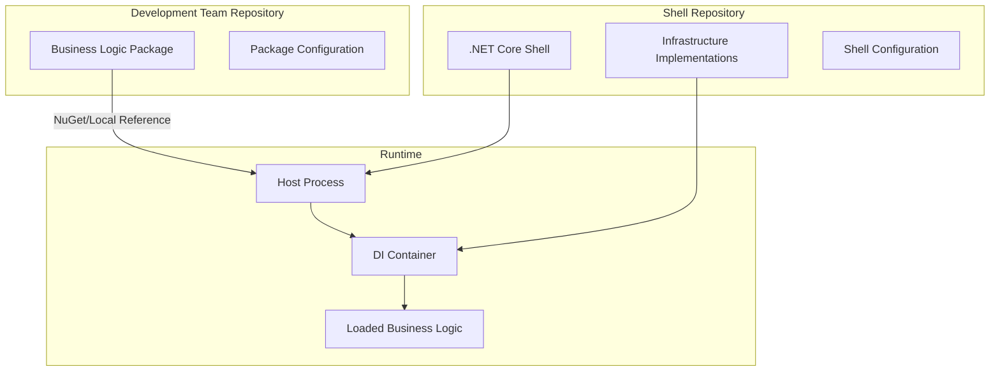

# .NET Core Shell Project Specification

## Executive Summary

The .NET Core Shell is a host application framework that provides a standardized runtime environment for business logic packages, similar to how Apache Tomcat hosts Java web applications. It abstracts common infrastructure concerns (authentication, authorization, logging, telemetry) through interfaces while providing concrete implementations, allowing development teams to focus solely on business logic.

## Project Overview

### Vision
Create a reusable .NET Core 9 shell application that serves as a runtime host for business logic packages, providing enterprise-grade infrastructure services out-of-the-box.

### Goals
- **Separation of Concerns**: Isolate business logic from infrastructure implementation
- **Standardization**: Provide consistent authentication, authorization, logging, and telemetry across all hosted applications
- **Developer Productivity**: Enable teams to focus on business value without reimplementing common patterns
- **Central Maintenance**: Allow a platform team to manage and update infrastructure components centrally
- **Local Development**: Support seamless local development with the same infrastructure as production

### Non-Goals
- Not a replacement for ASP.NET Core or other web frameworks
- Not a container orchestration platform
- Not responsible for deployment or CI/CD

## Technical Architecture

### Core Components

#### 1. Host Application (Shell)
- **Technology**: .NET Core 9 Web API / Generic Host
- **Responsibility**: Bootstrap and lifecycle management
- **Features**:
  - Dynamic package loading
  - Dependency injection container setup
  - Configuration management
  - Health checks and readiness probes

#### 2. Infrastructure Interfaces Package
- **Package**: `DotNetShell.Abstractions`
- **Contents**:
  ```csharp
  IAuthenticationService
  IAuthorizationService
  ILoggingService
  ITelemetryService
  IConfigurationProvider
  IMessageBus
  ICacheService
  IDataAccessService
  ```

#### 3. Infrastructure Implementations
- **Authentication**: JWT, OAuth 2.0, Azure AD, SAML
- **Authorization**: Role-based, Policy-based, Attribute-based
- **Logging**: Serilog with sinks (Console, File, Elasticsearch, Application Insights)
- **Telemetry**: OpenTelemetry with exporters (Jaeger, Prometheus, Azure Monitor)
- **Configuration**: Azure App Configuration, Consul, Environment variables, appsettings.json
- **Caching**: Redis, In-Memory, Distributed SQL
- **Message Bus**: Azure Service Bus, RabbitMQ, Kafka

#### 4. Plugin System
- **Discovery Mechanism**: Assembly scanning, NuGet package references
- **Loading Strategy**: AssemblyLoadContext for isolation
- **Lifecycle Hooks**:
  ```csharp
  public interface IBusinessLogicModule
  {
      Task OnInitializeAsync(IServiceCollection services);
      Task OnConfigureAsync(IApplicationBuilder app);
      Task OnStartAsync(CancellationToken cancellationToken);
      Task OnStopAsync(CancellationToken cancellationToken);
  }
  ```

### Deployment Architecture



### Package Structure

```
dotnet-shell/
├── src/
│   ├── DotNetShell.Host/              # Main shell application
│   ├── DotNetShell.Abstractions/      # Interface definitions
│   ├── DotNetShell.Core/              # Core implementations
│   ├── DotNetShell.Auth/              # Authentication implementations
│   ├── DotNetShell.Logging/           # Logging implementations
│   ├── DotNetShell.Telemetry/         # Telemetry implementations
│   └── DotNetShell.Extensions/        # Extension methods and utilities
├── samples/
│   ├── SampleBusinessLogic/           # Example business logic package
│   └── SampleIntegration/             # Integration examples
├── tests/
│   ├── unit/
│   └── integration/
└── docs/
```

## Implementation Approach

### Phase 1: Core Foundation (Weeks 1-2)
1. Create solution structure and projects
2. Define abstraction interfaces
3. Implement host application with basic DI
4. Create plugin loading mechanism
5. Setup basic configuration system

### Phase 2: Infrastructure Services (Weeks 3-4)
1. Implement authentication service with JWT support
2. Implement authorization service with role-based access
3. Integrate Serilog for structured logging
4. Add OpenTelemetry for basic metrics and traces
5. Implement health check endpoints

### Phase 3: Advanced Features (Weeks 5-6)
1. Add multiple authentication providers
2. Implement caching service
3. Add message bus abstraction and implementation
4. Create configuration hot-reload capability
5. Implement graceful shutdown and lifecycle management

### Phase 4: Developer Experience (Week 7)
1. Create project templates (dotnet new templates)
2. Build CLI tool for shell management
3. Create Visual Studio/VS Code extensions
4. Develop debugging and diagnostic tools
5. Write comprehensive documentation

### Phase 5: Testing & Hardening (Week 8)
1. Unit tests for all components
2. Integration tests for plugin loading
3. Performance benchmarks
4. Security audit
5. Load testing

## Usage Examples

### Business Logic Developer Workflow

1. **Create Business Logic Project**
```bash
dotnet new classlib -n MyBusinessLogic
dotnet add package DotNetShell.Abstractions
```

2. **Implement Business Module**
```csharp
public class MyBusinessModule : IBusinessLogicModule
{
    public async Task OnInitializeAsync(IServiceCollection services)
    {
        services.AddScoped<IMyBusinessService, MyBusinessService>();
        services.AddControllers();
    }

    public async Task OnConfigureAsync(IApplicationBuilder app)
    {
        app.UseEndpoints(endpoints =>
        {
            endpoints.MapControllers();
        });
    }
}
```

3. **Create Business Controller**
```csharp
[ApiController]
[Route("api/[controller]")]
public class ProductController : ControllerBase
{
    private readonly ILoggingService _logger;
    private readonly IAuthorizationService _authz;

    public ProductController(ILoggingService logger, IAuthorizationService authz)
    {
        _logger = logger;
        _authz = authz;
    }

    [HttpGet]
    public async Task<IActionResult> GetProducts()
    {
        _logger.LogInfo("Fetching products");
        // Business logic here
        return Ok(products);
    }
}
```

4. **Local Development**
```bash
# Clone shell
git clone https://github.com/company/dotnet-shell
cd dotnet-shell

# Reference business logic
dotnet add reference ../MyBusinessLogic/MyBusinessLogic.csproj

# Configure
echo '{"Modules": ["MyBusinessLogic.dll"]}' > appsettings.local.json

# Run
dotnet run
```

5. **Deployment**
```yaml
# docker-compose.yml
version: '3.8'
services:
  app:
    image: company/dotnet-shell:latest
    environment:
      - DOTNET_MODULES=/app/modules
    volumes:
      - ./MyBusinessLogic.dll:/app/modules/MyBusinessLogic.dll
    ports:
      - "5000:80"
```

## Configuration Schema

### Shell Configuration (appsettings.json)
```json
{
  "Shell": {
    "Modules": {
      "Sources": [
        {
          "Type": "Directory",
          "Path": "./modules"
        },
        {
          "Type": "NuGet",
          "Source": "https://api.nuget.org/v3/index.json",
          "Packages": ["MyCompany.BusinessLogic"]
        }
      ],
      "LoadingStrategy": "Isolated"
    },
    "Authentication": {
      "DefaultScheme": "JWT",
      "Providers": {
        "JWT": {
          "Authority": "https://login.microsoftonline.com/",
          "Audience": "api://my-api"
        }
      }
    },
    "Logging": {
      "MinimumLevel": "Information",
      "WriteTo": ["Console", "File", "Elasticsearch"]
    },
    "Telemetry": {
      "Enabled": true,
      "Exporters": ["Console", "Jaeger", "Prometheus"]
    }
  }
}
```

### Business Logic Configuration
```json
{
  "Module": {
    "Name": "MyBusinessLogic",
    "Version": "1.0.0",
    "EntryPoint": "MyBusinessLogic.MyBusinessModule",
    "Dependencies": {
      "MinShellVersion": "1.0.0",
      "RequiredServices": ["IAuthenticationService", "ILoggingService"]
    },
    "Settings": {
      "ConnectionString": "Server=localhost;Database=MyDB",
      "ApiKey": "{{Vault:ApiKey}}"
    }
  }
}
```

## Key Design Decisions

### 1. Plugin Isolation
- **Decision**: Use AssemblyLoadContext for plugin isolation
- **Rationale**: Prevents version conflicts and allows hot-reload
- **Trade-off**: Slightly more complex than simple assembly loading

### 2. Configuration Management
- **Decision**: Hierarchical configuration with override capability
- **Rationale**: Supports environment-specific settings without code changes
- **Trade-off**: More complex than single configuration file

### 3. Dependency Injection
- **Decision**: Use Microsoft.Extensions.DependencyInjection
- **Rationale**: Standard in .NET ecosystem, familiar to developers
- **Trade-off**: Less features than some third-party containers

### 4. Async-First Design
- **Decision**: All lifecycle methods and services are async
- **Rationale**: Better performance and scalability
- **Trade-off**: Slightly more complex API

## Success Metrics

### Technical Metrics
- Startup time < 3 seconds for typical business logic
- Memory overhead < 100MB for shell components
- Support for 100+ concurrent business modules
- 99.9% uptime in production

### Developer Experience Metrics
- Time to first running application < 10 minutes
- Zero infrastructure code in business logic
- 90% reduction in boilerplate code
- Complete local/production parity

### Business Metrics
- 50% reduction in time to market for new services
- 75% reduction in infrastructure-related bugs
- Centralized security updates affect all services immediately
- Single point of compliance for infrastructure concerns

## Security Considerations

### Authentication & Authorization
- Support for multiple authentication schemes simultaneously
- Token validation and refresh
- Rate limiting per authenticated user
- Audit logging of all authorization decisions

### Data Protection
- Automatic encryption of sensitive configuration
- Secret management integration (Azure Key Vault, HashiCorp Vault)
- TLS 1.3 for all external communications
- Data sanitization in logs

### Runtime Security
- Assembly signature validation
- Sandbox execution for untrusted modules
- Resource quotas per module
- Security headers (CORS, CSP, etc.)

## Monitoring & Observability

### Health Checks
```csharp
/health/live    - Is the process running?
/health/ready   - Are all modules loaded and ready?
/health/startup - Initial startup check
```

### Metrics
- Request rate, duration, and errors (RED metrics)
- Module load time and memory usage
- Cache hit rates
- Authentication success/failure rates

### Distributed Tracing
- Automatic trace context propagation
- Span creation for module boundaries
- Integration with APM tools

### Logging
- Structured logging with correlation IDs
- Log aggregation support
- Dynamic log level adjustment
- PII scrubbing

## Migration Strategy

### For Existing Applications
1. Extract business logic into separate assembly
2. Implement IBusinessLogicModule interface
3. Replace infrastructure code with interface usage
4. Test locally with shell
5. Deploy using shell container

### Gradual Adoption
1. Start with non-critical services
2. Migrate authentication/authorization first
3. Add logging and telemetry
4. Move critical services after validation

## Risks & Mitigations

### Risk 1: Performance Overhead
- **Mitigation**: Benchmark and optimize hot paths, use caching aggressively

### Risk 2: Debugging Complexity
- **Mitigation**: Comprehensive logging, source link support, debugging tools

### Risk 3: Version Conflicts
- **Mitigation**: Isolated loading contexts, clear versioning strategy

### Risk 4: Learning Curve
- **Mitigation**: Extensive documentation, templates, examples, training

## Alternatives Considered

### 1. Microservices with Sidecar Pattern
- **Pros**: Language agnostic, Kubernetes native
- **Cons**: More complex deployment, network overhead
- **Decision**: Shell approach simpler for .NET-only ecosystem

### 2. Source Generators / Compile-Time Weaving
- **Pros**: No runtime overhead, type safety
- **Cons**: Less flexible, requires recompilation
- **Decision**: Runtime approach allows central updates

### 3. Traditional Shared Libraries
- **Pros**: Simple, familiar
- **Cons**: Version conflicts, no central control
- **Decision**: Shell provides better isolation and control

## Appendix

### Sample Business Logic Package

See `/samples/SampleBusinessLogic` for a complete example including:
- REST API controllers
- Background services
- Event handlers
- Database operations
- External API calls

### Interface Definitions

Complete interface definitions available in `/src/DotNetShell.Abstractions/Interfaces`

### Performance Benchmarks

Benchmark results comparing shell overhead vs. direct implementation available in `/benchmarks`

### Compliance Checklist

- [ ] GDPR compliance for logging
- [ ] SOC 2 audit requirements
- [ ] HIPAA considerations
- [ ] PCI DSS for payment processing modules

---

## Next Steps

1. Review and approve specification
2. Set up project repositories
3. Form implementation team
4. Begin Phase 1 development
5. Schedule weekly progress reviews

## References

- [.NET Core Hosting Documentation](https://docs.microsoft.com/dotnet/core/extensions/hosting)
- [AssemblyLoadContext Guide](https://docs.microsoft.com/dotnet/core/dependency-loading/understanding-assemblyloadcontext)
- [OpenTelemetry .NET](https://opentelemetry.io/docs/instrumentation/net/)
- [Apache Tomcat Architecture](https://tomcat.apache.org/tomcat-9.0-doc/architecture/overview.html)